Trying my hand at this Kaggle thing.

In this script, we'll use random forests to attempt to predict survival of individual passengers on the Titanic.

Set up workspace and data -
---------------------------

``` r
library(randomForest)
library(ggplot2)
library(lattice)
library(RColorBrewer)
library(gridExtra)
library(dplyr)
library(mice)
library(scales)
library(caret)
library(ROSE)

# Working directory with data
wd = "C:/Users/esc642/Desktop/workbox/kaggle/titanic"
setwd(wd)

# Read in data
train = read.csv(sprintf("%s/train.csv", wd),
                 head = T, na.strings=c("", "NA"))
test = read.csv(sprintf("%s/test.csv", wd),
                head = T, na.strings=c("", "NA"))

# Combine for feature engineering purposes
fullData = bind_rows(train, test)

# Convert survival to factor
fullData$surviveFactor=as.factor(as.character(fullData$Survived))
```

------------------------------------------------------------------------

------------------------------------------------------------------------

Inspect data, basic visualizations
----------------------------------

``` r
# How many built in features and how many passengers?
ncol(fullData)
```

    ## [1] 13

``` r
nrow(fullData)
```

    ## [1] 1309

``` r
summary(fullData)
```

    ##   PassengerId      Survived          Pclass          Name          
    ##  Min.   :   1   Min.   :0.0000   Min.   :1.000   Length:1309       
    ##  1st Qu.: 328   1st Qu.:0.0000   1st Qu.:2.000   Class :character  
    ##  Median : 655   Median :0.0000   Median :3.000   Mode  :character  
    ##  Mean   : 655   Mean   :0.3838   Mean   :2.295                     
    ##  3rd Qu.: 982   3rd Qu.:1.0000   3rd Qu.:3.000                     
    ##  Max.   :1309   Max.   :1.0000   Max.   :3.000                     
    ##                 NA's   :418                                        
    ##      Sex           Age            SibSp            Parch      
    ##  female:466   Min.   : 0.17   Min.   :0.0000   Min.   :0.000  
    ##  male  :843   1st Qu.:21.00   1st Qu.:0.0000   1st Qu.:0.000  
    ##               Median :28.00   Median :0.0000   Median :0.000  
    ##               Mean   :29.88   Mean   :0.4989   Mean   :0.385  
    ##               3rd Qu.:39.00   3rd Qu.:1.0000   3rd Qu.:0.000  
    ##               Max.   :80.00   Max.   :8.0000   Max.   :9.000  
    ##               NA's   :263                                     
    ##     Ticket               Fare            Cabin           Embarked  
    ##  Length:1309        Min.   :  0.000   Length:1309        C   :270  
    ##  Class :character   1st Qu.:  7.896   Class :character   Q   :123  
    ##  Mode  :character   Median : 14.454   Mode  :character   S   :914  
    ##                     Mean   : 33.295                      NA's:  2  
    ##                     3rd Qu.: 31.275                                
    ##                     Max.   :512.329                                
    ##                     NA's   :1                                      
    ##  surviveFactor
    ##  0   :549     
    ##  1   :342     
    ##  NA's:418     
    ##               
    ##               
    ##               
    ## 

Looks like there are NAs in age, which we can try to predict. Two passengers are also missing their embarkment. Many are also missing their cabin assignment.

### Individual feature inspection and visualization

For the visualizations below, NAs on survival (i.e. the test set) will be dropped.

``` r
prop.table(xtabs(~Survived + Sex, data = fullData), 2)
```

    ##         Sex
    ## Survived    female      male
    ##        0 0.2579618 0.8110919
    ##        1 0.7420382 0.1889081

``` r
mosaicplot(~Survived + Sex, data = fullData, col = c("red", "blue"),
           main = "Survival by gender")
```


Women were much more likely to survive than men.

``` r
prop.table(xtabs(~Survived + Pclass, data = fullData), 2)
```

    ##         Pclass
    ## Survived         1         2         3
    ##        0 0.3703704 0.5271739 0.7576375
    ##        1 0.6296296 0.4728261 0.2423625

``` r
mosaicplot(~Survived + Pclass, data = fullData, 
           col = brewer.pal(3, "YlGnBu"),
           main = "Survival by class")
```

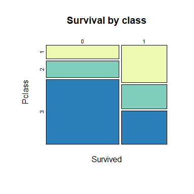

Much worse survival odds in 3rd class than 1st.

``` r
ggplot(data=subset(fullData, !is.na(Survived)), aes(x = Age)) +
  geom_density(aes(fill = as.factor(Survived),
                   group = as.factor(Survived)), alpha = 0.3) +
                 theme_bw() +
  ggtitle("Survival by age")
```

    ## Warning: Removed 177 rows containing non-finite values (stat_density).

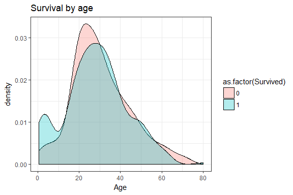

Children are surviving; the 20-something range may be more dangerous for passengers.

``` r
ggplot(data=subset(fullData, !is.na(Survived)), aes(x = log(Fare))) +
  geom_density(aes(fill = as.factor(Survived),
                   group = as.factor(Survived)), alpha = 0.3) +
                 theme_bw() +
  ggtitle("Survival by ticket fare")
```

    ## Warning: Removed 15 rows containing non-finite values (stat_density).

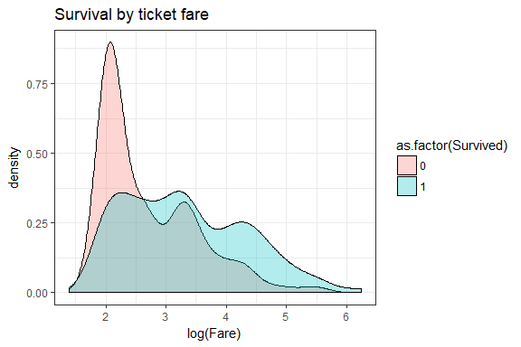

Consistent with class, those at the lower end of the fare scale fared (sorry) much worse.

``` r
# Siblings and spouses
ssPlot = ggplot(data=subset(fullData, !is.na(Survived)), aes(as.factor(SibSp))) +
         geom_bar(aes(group = as.factor(Survived),
                      fill = as.factor(Survived),
                      color = as.factor(Survived)),
                  position = "dodge", alpha = 0.5) +
  theme_bw() +
  ggtitle("Survival by siblings/spouses")

# Parents and children
pcPlot = ggplot(data=subset(fullData, !is.na(Survived)), aes(as.factor(Parch))) +
         geom_bar(aes(group = as.factor(Survived),
                      fill = as.factor(Survived),
                      color = as.factor(Survived)),
                  position = "dodge", alpha = 0.5) +
  theme_bw() +
  ggtitle("Survival by parents/children")

grid.arrange(ssPlot, pcPlot, ncol = 2)
```

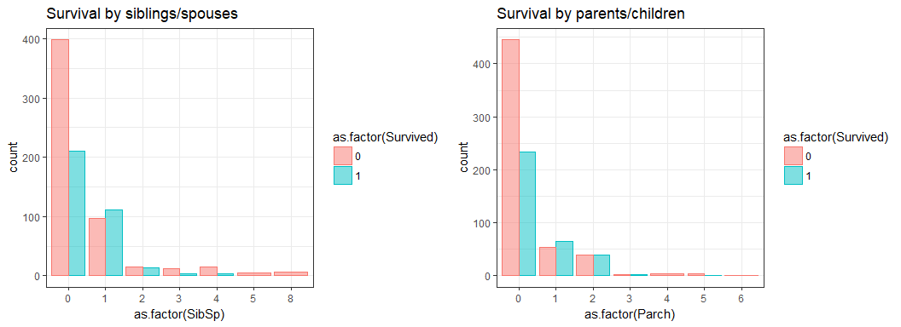

Together, these suggest that solo travelers and large families did poorly, but having one sibling/spouse and one or two parents/children was not so bad. Later, we'll combine these into a single family size variable.

``` r
# Siblings and spouses
ggplot(data=subset(fullData, !is.na(Survived)), aes(as.factor(Embarked))) +
         geom_bar(aes(group = as.factor(Survived),
                      fill = as.factor(Survived),
                      color = as.factor(Survived)),
                  position = "dodge", alpha = 0.5) +
  theme_bw() +
  ggtitle("Survival by embarkment location")
```

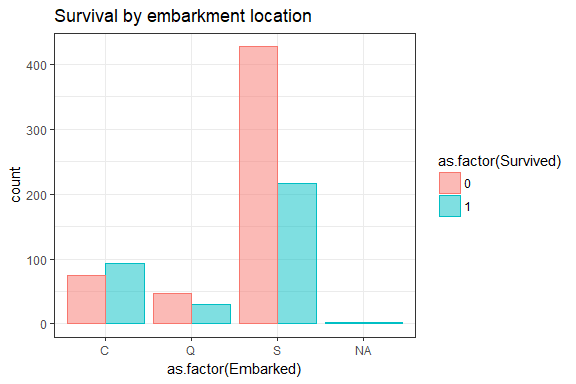

``` r
xtabs(~Embarked + Survived, data = fullData)
```

    ##         Survived
    ## Embarked   0   1
    ##        C  75  93
    ##        Q  47  30
    ##        S 427 217

Cherbourg embarkments were slightly more auspicious than not. Queensland's survival rate reflects the survival rate as a whole. Southhampton is 2:1 death.

------------------------------------------------------------------------

------------------------------------------------------------------------

Feature engineering
-------------------

Several additional features can be extracted from the data we have.

### Title

A person's title can give us some insight into their social station, marital status, and age.

``` r
# First, cut name between comma and period
fullData$title =  gsub(".*,(.*)\\..*", "\\1", as.character(fullData$Name))
fullData$title = gsub(" ", "", fullData$title)
fullData$title = gsub("\\.", "", fullData$title)

unique(fullData$title)
```

    ##  [1] "Mr"                   "Mrs"                  "Miss"                
    ##  [4] "Master"               "Don"                  "Rev"                 
    ##  [7] "Dr"                   "Mme"                  "Ms"                  
    ## [10] "Major"                "MrsMartin(ElizabethL" "Lady"                
    ## [13] "Sir"                  "Mlle"                 "Col"                 
    ## [16] "Capt"                 "theCountess"          "Jonkheer"            
    ## [19] "Dona"

``` r
# Fix two
fullData[fullData$Name == "Rothschild, Mrs. Martin (Elizabeth L. Barrett)",]$title = "Mrs"
fullData[fullData$title == "theCountess",]$title = "Countess"

# Collapse French and English titles
fullData[fullData$title == "Mlle",]$title = "Miss"
fullData[fullData$title == "Mme",]$title = "Mrs"

# Condense unusual titles (N < 10)
fullData$title2 = fullData$title
rareTitles = names(which(table(fullData$title) < 10))
fullData[fullData$title2 %in% rareTitles,]$title2 = "other"

unique(rareTitles)
```

    ##  [1] "Capt"     "Col"      "Countess" "Don"      "Dona"     "Dr"      
    ##  [7] "Jonkheer" "Lady"     "Major"    "Ms"       "Rev"      "Sir"

``` r
# Our five titles
table(fullData$title2)
```

    ## 
    ## Master   Miss     Mr    Mrs  other 
    ##     61    262    757    198     31

``` r
# Do they match up with age as expected?
boxplot(Age ~ title2, data = fullData)
```

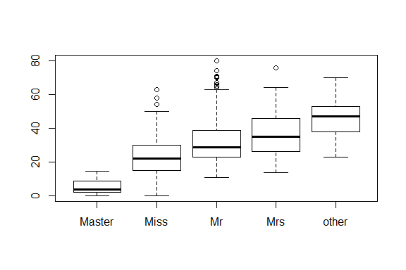

The age data looks reasonable. Master is only for male children; Miss's range is older as it also covers unmarried adult women. "Other" titles tend to be older; many are professions, so this is unsurprising.

### Family size

We can combine the sibling/spouse and parent/child information into an easier-to-parse family size variable.

``` r
fullData$familySize = fullData$Parch + fullData$SibSp

ggplot(data = subset(fullData, !is.na(Survived)), aes(as.factor(familySize))) +
         geom_bar(aes(group = as.factor(Survived),
                      fill = as.factor(Survived),
                      color = as.factor(Survived)),
                  position = "dodge", alpha = 0.5) +
  theme_bw() +
  ggtitle("Survival by family size")
```

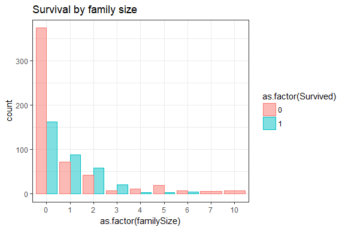

Now we can see more clearly: traveling with a small family (1-3 other members) is advantageous. Solo travelers (family size = 0) and big families (&gt; 3) are more at risk. Huge families (7, 10) don't survive at all.

### Cabin parsing

We'll extract two pieces of information from cabin: the number of rooms, and the letter of the deck(?) that the cabin was on.

``` r
# Inspect to see what we have
unique(fullData$Cabin)
```

    ##   [1] NA                "C85"             "C123"           
    ##   [4] "E46"             "G6"              "C103"           
    ##   [7] "D56"             "A6"              "C23 C25 C27"    
    ##  [10] "B78"             "D33"             "B30"            
    ##  [13] "C52"             "B28"             "C83"            
    ##  [16] "F33"             "F G73"           "E31"            
    ##  [19] "A5"              "D10 D12"         "D26"            
    ##  [22] "C110"            "B58 B60"         "E101"           
    ##  [25] "F E69"           "D47"             "B86"            
    ##  [28] "F2"              "C2"              "E33"            
    ##  [31] "B19"             "A7"              "C49"            
    ##  [34] "F4"              "A32"             "B4"             
    ##  [37] "B80"             "A31"             "D36"            
    ##  [40] "D15"             "C93"             "C78"            
    ##  [43] "D35"             "C87"             "B77"            
    ##  [46] "E67"             "B94"             "C125"           
    ##  [49] "C99"             "C118"            "D7"             
    ##  [52] "A19"             "B49"             "D"              
    ##  [55] "C22 C26"         "C106"            "C65"            
    ##  [58] "E36"             "C54"             "B57 B59 B63 B66"
    ##  [61] "C7"              "E34"             "C32"            
    ##  [64] "B18"             "C124"            "C91"            
    ##  [67] "E40"             "T"               "C128"           
    ##  [70] "D37"             "B35"             "E50"            
    ##  [73] "C82"             "B96 B98"         "E10"            
    ##  [76] "E44"             "A34"             "C104"           
    ##  [79] "C111"            "C92"             "E38"            
    ##  [82] "D21"             "E12"             "E63"            
    ##  [85] "A14"             "B37"             "C30"            
    ##  [88] "D20"             "B79"             "E25"            
    ##  [91] "D46"             "B73"             "C95"            
    ##  [94] "B38"             "B39"             "B22"            
    ##  [97] "C86"             "C70"             "A16"            
    ## [100] "C101"            "C68"             "A10"            
    ## [103] "E68"             "B41"             "A20"            
    ## [106] "D19"             "D50"             "D9"             
    ## [109] "A23"             "B50"             "A26"            
    ## [112] "D48"             "E58"             "C126"           
    ## [115] "B71"             "B51 B53 B55"     "D49"            
    ## [118] "B5"              "B20"             "F G63"          
    ## [121] "C62 C64"         "E24"             "C90"            
    ## [124] "C45"             "E8"              "B101"           
    ## [127] "D45"             "C46"             "D30"            
    ## [130] "E121"            "D11"             "E77"            
    ## [133] "F38"             "B3"              "D6"             
    ## [136] "B82 B84"         "D17"             "A36"            
    ## [139] "B102"            "B69"             "E49"            
    ## [142] "C47"             "D28"             "E17"            
    ## [145] "A24"             "C50"             "B42"            
    ## [148] "C148"            "B45"             "B36"            
    ## [151] "A21"             "D34"             "A9"             
    ## [154] "C31"             "B61"             "C53"            
    ## [157] "D43"             "C130"            "C132"           
    ## [160] "C55 C57"         "C116"            "F"              
    ## [163] "A29"             "C6"              "C28"            
    ## [166] "C51"             "C97"             "D22"            
    ## [169] "B10"             "E45"             "E52"            
    ## [172] "A11"             "B11"             "C80"            
    ## [175] "C89"             "F E46"           "B26"            
    ## [178] "F E57"           "A18"             "E60"            
    ## [181] "E39 E41"         "B52 B54 B56"     "C39"            
    ## [184] "B24"             "D40"             "D38"            
    ## [187] "C105"

``` r
# Most cases of spaces seem to be multiple rooms, but there are examples on F deck that seem to be followed by a number with E or G. Googling a few of these passangers suggests that those are in fact on F-deck, so we'll first adjust to ensure that that is represented. 

fullData$origCabin = fullData$Cabin
fullData$Cabin = gsub("F E", "F", fullData$Cabin)
fullData$Cabin = gsub("F G", "F", fullData$Cabin)

# Now we can count the number of rooms
fullData$roomCount = sapply(strsplit(fullData$Cabin, " "), length)

# Pull name of deck
fullData$Deck = gsub("\\d", "", fullData$Cabin)
# Restrict to first character to cover cases of multiple rooms
fullData$Deck = substr(fullData$Deck, 1, 1)


# Look at survival by deck and number of rooms
numRoomPlot = ggplot(data=subset(fullData, !is.na(Survived)),
                     aes(as.factor(roomCount))) +
         geom_bar(aes(group = as.factor(Survived),
                      fill = as.factor(Survived),
                      color = as.factor(Survived)),
                  position = "dodge", alpha = 0.5) +
  theme_bw() +
  ggtitle("Survival by number of rooms")

deckPlot = ggplot(data=subset(fullData, !is.na(Survived)),
                  aes(as.factor(Deck))) +
         geom_bar(aes(group = as.factor(Survived),
                      fill = as.factor(Survived),
                      color = as.factor(Survived)),
                  position = "dodge", alpha = 0.5) +
  theme_bw() +
  ggtitle("Survival by cabin deck")

grid.arrange(numRoomPlot, deckPlot, ncol = 2)
```

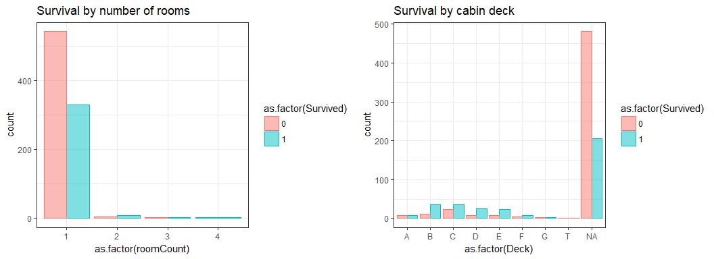

Maybe number of rooms is not so informative, as cases of &gt; 1 are rare. Tough to say about deck, beyond the fact that we seem to have more survivors among the ones with full cabin info than those without.

------------------------------------------------------------------------

------------------------------------------------------------------------

NA amelioration
---------------

Four features have NAs: Embarked, Cabin, and Age.

### Fare

Just a single person is missing fare information.

``` r
fullData[which(is.na(fullData$Fare)),]
```

    ##      PassengerId Survived Pclass               Name  Sex  Age SibSp Parch
    ## 1044        1044       NA      3 Storey, Mr. Thomas male 60.5     0     0
    ##      Ticket Fare Cabin Embarked surviveFactor title title2 familySize
    ## 1044   3701   NA  <NA>        S          <NA>    Mr     Mr          0
    ##      origCabin roomCount Deck
    ## 1044      <NA>         1 <NA>

``` r
# We don't have cabin or deck information for tihs passenger, but we do know he was in third class and departed from Southhampton. Let's look at the faare values of passengers in that class/embarkment location.

boxplot(fullData[fullData$Embarked == "S" & fullData$Pclass == 3,]$Fare)
```

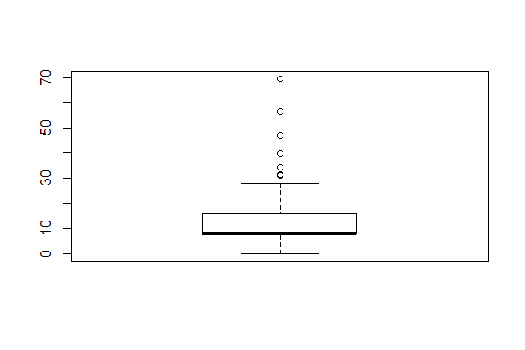

``` r
mean(fullData[fullData$Embarked == "S" & fullData$Pclass == 3,]$Fare,
     na.rm=T)
```

    ## [1] 14.43542

``` r
median(fullData[fullData$Embarked == "S" & fullData$Pclass == 3,]$Fare,
       na.rm=T)
```

    ## [1] 8.05

``` r
# There are some outliers, so the median might be a safer choice here.
fullData[which(is.na(fullData$Fare)),]$Fare = median(
  fullData[fullData$Embarked == "S" & fullData$Pclass == 3,]$Fare,
       na.rm=T)
```

### Embarked

``` r
# Find the missing rows
which(is.na(fullData$Embarked))
```

    ## [1]  62 830

``` r
# check info on these people
fullData[c(62, 830),]
```

    ##     PassengerId Survived Pclass                                      Name
    ## 62           62        1      1                       Icard, Miss. Amelie
    ## 830         830        1      1 Stone, Mrs. George Nelson (Martha Evelyn)
    ##        Sex Age SibSp Parch Ticket Fare Cabin Embarked surviveFactor title
    ## 62  female  38     0     0 113572   80   B28     <NA>             1  Miss
    ## 830 female  62     0     0 113572   80   B28     <NA>             1   Mrs
    ##     title2 familySize origCabin roomCount Deck
    ## 62    Miss          0       B28         1    B
    ## 830    Mrs          0       B28         1    B

``` r
# Interestingly, both shared a cabin, have the same ticket, and paid the same price. So they likely traveled together, and we can likely assume the same embarked value for both.

# Did they travel with relatives? Check for shared surnames
grep("Icard", fullData$Name)
```

    ## [1] 62

``` r
grep("Stone", fullData$Name) # False alarm: a different Stone
```

    ## [1] 320 830

``` r
# Makes sense; family size for both is 0.

# Let's see if we can find simliar fares in the data set for first class passengers.
xtabs(~Embarked + Pclass,
              data = fullData[fullData$Fare > 70 & fullData$Fare < 90,])
```

    ##         Pclass
    ## Embarked  1  2
    ##        C 29  0
    ##        Q  0  0
    ##        S 23  7

``` r
# Could be either Cherbourg or Southhampton. Slightly more consistency in this range in Cherbourg, so let's set that as the value for these two passengers.

fullData[c(62, 830),]$Embarked = "C"
```

### Age

Several missing values for Age, so let's try imputing them by predicting them from the other features.

``` r
# First ID those values that are and are not missing, so we can sanity-check after imputation.
hasAge = which(!is.na(fullData$Age))
missAge = which(is.na(fullData$Age))

# Save data as a backup
fullSaver = fullData

# Convert relevant factors to factor to play nice with imputation
factor_vars <- c("Pclass", "Sex", "title")
fullData[factor_vars] <- lapply(fullData[factor_vars], function(x) as.factor(x))

# Use multiple imputation to generate predicted values for age
# Only using features that are not too granular (e.g. name, ticket)
# 5 imputations, default method (pmm) should be ok for a dataset this size
ageMI = mice(fullData[,c("Age", "Pclass", "Sex", "SibSp", "Parch", "title")],
             m = 5)
```

    ## 
    ##  iter imp variable
    ##   1   1  Age
    ##   1   2  Age
    ##   1   3  Age
    ##   1   4  Age
    ##   1   5  Age
    ##   2   1  Age
    ##   2   2  Age
    ##   2   3  Age
    ##   2   4  Age
    ##   2   5  Age
    ##   3   1  Age
    ##   3   2  Age
    ##   3   3  Age
    ##   3   4  Age
    ##   3   5  Age
    ##   4   1  Age
    ##   4   2  Age
    ##   4   3  Age
    ##   4   4  Age
    ##   4   5  Age
    ##   5   1  Age
    ##   5   2  Age
    ##   5   3  Age
    ##   5   4  Age
    ##   5   5  Age

``` r
# Get all imputations from the first "round" for now
miOutput <- complete(ageMI,1 )

# Add these values back to the dataset
fullData$Age = miOutput$Age

# Double-check that the non-NA data hasn't changed
which(fullData[hasAge,]$Age != fullSaver[hasAge,]$Age)
```

    ## integer(0)

``` r
# # Check to see if predicted Age values fall in a reasonable range
plotData = fullData # new dataset to hold some useful plotting features
plotData$ageImputed = "actual"
plotData[missAge,]$ageImputed = "imputed"

ggplot(plotData, aes(x = "", y = Age)) + 
  geom_boxplot(alpha = 0.3) +
  geom_point(aes(y = Age, colour = factor(ageImputed), 
                 shape = factor(ageImputed)
                 ), alpha = 0.4,
             position = "jitter") +
  theme_bw() 
```

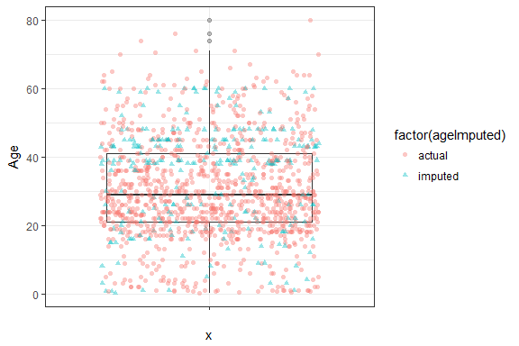

Not wild values, probably reasonable.

**For the future:**
+ Investigate how to combine predictions from multiple imputations - what is appropriate?
+ Could get more fancy here with bootstrapping to increase confidence in imputed values: <https://www.jstor.org/stable/2291746>
(See also: <https://stats.stackexchange.com/questions/265079/multiple-imputations-predictive-modeling>)

### Cabin/deck

Cabin is too fined-grained a feature to use in our model, but we could potentially determine deck from a combination of ticket fare and class. However, over 1000 data points are missing this information. So it would be very difficult to tease apart decks within the classes. We'll have to set this feature aside for now.

------------------------------------------------------------------------

------------------------------------------------------------------------

Feature coding and data splitting
---------------------------------

Before running our model, we need to encode categorical factors in one-hot encoding, scale numeric predictors, and re-split our data into training and test.

First, clean up some columns that we won't use.

``` r
# Save data again
fullSaver2 = fullData

# Drop columns
fullData$Name = NULL
fullData$Ticket = NULL
fullData$Cabin = NULL
fullData$title = NULL
fullData$origCabin = NULL
fullData$surviveFactor = NULL
fullData$Deck = NULL
```

Scale numeric variables.

``` r
# Hold aside binary and categorical variables
dataBin = fullData[, c('PassengerId', 'Pclass', 'Survived', 'Sex', 'Embarked', 
                      'title2')]

binCols = which(colnames(fullData) %in% colnames(dataBin))

# Separate out just continuous variables
dataCont = fullData[,-binCols]

# Scale these
dataCont2 = data.frame(lapply(dataCont, function(x) rescale(x)))

# Merge data back together
fullData = cbind(dataBin, dataCont2)
```

Convert sex, class, and title to numeric or one-hot encoding/

``` r
# Sex is binary - just convert to numeric
fullData$Sex = ifelse(fullData$Sex == "female", 1, 0)

# Convert title and Embarked to factor, then one-hot
fullData$title2 = as.factor(as.character(fullData$title2))
fullData$Embarked = as.factor(as.character(fullData$Embarked))

fullSaver3 = fullData
fullDummy = dummyVars(~., data = fullData)
fullData <- as.data.frame(predict(fullDummy, newdata = fullData))
```

Finally, split data.

``` r
# Split by passenger IDs from the original files
trainSet = fullData[fullData$PassengerId %in% train$PassengerId,]
testSet = fullData[fullData$PassengerId %in% test$PassengerId,]


# Drop Survived from test set (all NAs)
testSet$Survived = NULL

# Further split train data into a train-train and a test-train set.
trainTrainN = round(nrow(trainSet)*.75, 0) # how much is 75% of the data?
trainTrainSet = trainSet[sample(nrow(trainSet), trainTrainN), ] 
trainTestSet = trainSet[!(trainSet$PassengerId %in% trainTrainSet$PassengerId),]

# Remove PassengerID from training sets
trainTrainSaver = trainTrainSet
trainTestSaver = trainTestSet
trainTrainSet$PassengerId = NULL
trainTestSet$PassengerId = NULL
```

Model fitting
-------------

We'll first try a basic default random forests model, and then explore how we can improve it by (1) over/under sampling to account for imbalances in the data set, and (2) tuning the parameters of the model.

### Model 1: base model

``` r
# Fit basic model on trainTrainset
model1 <- randomForest(factor(Survived) ~ .,  
              data = trainTrainSet)


# Check accuracy on our training set
predTrainDF1 = trainTrainSet
predTrainDF1$pred = model1$predicted
xtabs(~pred + Survived, data = predTrainDF1)
```

    ##     Survived
    ## pred   0   1
    ##    0 365  67
    ##    1  46 190

Looks decent, but does it generalize to the trainTest data?

``` r
model1Pred = predict(model1, newdata = trainTestSet)

# Append the predictions to the test data and look at performance
predTestDF = trainTestSet
predTestDF$predModel1 = model1Pred
predTestDF$accModel1 = ifelse(predTestDF$pred == predTestDF$Survived, 1, 0)

xtabs(~predModel1 + Survived, data = predTestDF)
```

    ##           Survived
    ## predModel1   0   1
    ##          0 128  27
    ##          1  10  58

Pretty decent. But our data is slightly imbalanced (more people died than survived). Can we improve the model by weighting the data to account for this?

### Model(s) 2: over and undersampling

One potential way to improve would be to play with different values of sampling: we can undersample the majority class, oversample the minority class, or use an alogirthm to generate predicted values to balance the data set.

``` r
# Oversample - bring up to 820 so survived N = died N
overTrainDF = ovun.sample(Survived ~ ., data = trainTrainSet, 
                            method = "over", N= 820)$data
table(overTrainDF$Survived)
```

    ## 
    ##   0   1 
    ## 411 409

``` r
# Undersample - bring down to 516 to survived N = died N
underTrainDF = ovun.sample(Survived ~ ., data = trainTrainSet,
                            method = "under", N = 516)$data
table(underTrainDF$Survived)
```

    ## 
    ##   0   1 
    ## 259 257

``` r
# ROSE algorithm: predictively generate underrepresented class
roseTrainDF = ROSE(Survived ~ ., data = trainTrainSet, p = 0.5)$data
table(roseTrainDF$Survived)
```

    ## 
    ##   0   1 
    ## 349 319

Now we'll run each model and see how it does.

Run each model.

``` r
modelOver <- randomForest(factor(Survived) ~ .,  
              data = overTrainDF)

modelUnder <- randomForest(factor(Survived) ~ .,  
              data = underTrainDF)

modelRose <- randomForest(factor(Survived) ~ .,  
              data = roseTrainDF)


# Predict data for each
modelOverPred = predict(modelOver, newdata = trainTestSet)
modelUnderPred = predict(modelUnder, newdata = trainTestSet)
modelRosePred = predict(modelRose, newdata = trainTestSet)

# Append these results to our original table for comparing labels and predictions

predTestDF$predModel2Over = modelOverPred
predTestDF$predModel2Under = modelUnderPred
predTestDF$predModel2Rose = modelRosePred

# Save all confusion matrices
confOrig = xtabs(~predModel1 + Survived, data = predTestDF)
confOver = xtabs(~predModel2Over + Survived, data = predTestDF)
confUnder = xtabs(~predModel2Under + Survived, data = predTestDF)
confRose = xtabs(~predModel2Rose + Survived, data = predTestDF)

confOrig
```

    ##           Survived
    ## predModel1   0   1
    ##          0 128  27
    ##          1  10  58

``` r
confOver
```

    ##               Survived
    ## predModel2Over   0   1
    ##              0 121  22
    ##              1  17  63

``` r
confUnder
```

    ##                Survived
    ## predModel2Under   0   1
    ##               0 124  23
    ##               1  14  62

``` r
confRose
```

    ##               Survived
    ## predModel2Rose   0   1
    ##              0 132  31
    ##              1   6  54

Finally, let's look at accuracy, recall, and precision under each.

``` r
accDF = data.frame(c("orig", "over", "under", "rose"))
colnames(accDF) = "model"
accDF$acc = ""
accDF$recall = ""
accDF$prec = ""

for (i in 1:nrow(accDF)){
  if(accDF$model[i] == "orig") {
    targetConf = confOrig 
     } else if (accDF$model[i] == "over") {
       targetConf = confOver 
       } else if (accDF$model[i] == "under") {
         targetConf = confUnder 
       } else {
           targetConf = confRose}
accDF$acc[i] = round((targetConf[1,1] + targetConf[2,2])/sum(targetConf), 3)
accDF$prec[i] = round(targetConf[1,1]/(targetConf[1,1] + targetConf[1,2]), 3)
accDF$recall[i] = round(targetConf[1,1]/(targetConf[1,1] + targetConf[2,1]), 3)
}
        
accDF
```

    ##   model   acc recall  prec
    ## 1  orig 0.834  0.928 0.826
    ## 2  over 0.825  0.877 0.846
    ## 3 under 0.834  0.899 0.844
    ## 4  rose 0.834  0.957  0.81

The models all perform similarly. Because over- and under-sampling does not seem to strongly correct things, let's stick with the original model.

### Model(s) 3: tuning parameters with grid search

The ROSE algorithm data seems like our best bet. Now htat we've got that, let's see if we can tune the RF parameters to get a slightly better prediction.

``` r
tuneFeatures = trainTrainSet
tuneFeatures$Survived = NULL

# search for best mtry (number of variables available for splitting at each node)
# allow 500 trees, demand improvement of at least 1e-5 for search to continue
# step mtry by stepFactor
bestmtry <- tuneRF(y = factor(trainTrainSet$Survived), 
                   x = tuneFeatures, 
                   nTreeTry = 500,
                   stepFactor=1.5, improve=1e-5)
```

    ## mtry = 4  OOB error = 18.41% 
    ## Searching left ...
    ## mtry = 3     OOB error = 17.81% 
    ## 0.03252033 1e-05 
    ## mtry = 2     OOB error = 17.66% 
    ## 0.008403361 1e-05 
    ## Searching right ...
    ## mtry = 6     OOB error = 17.96% 
    ## -0.01694915 1e-05

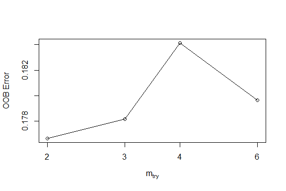

``` r
print(bestmtry)
```

    ##       mtry  OOBError
    ## 2.OOB    2 0.1766467
    ## 3.OOB    3 0.1781437
    ## 4.OOB    4 0.1841317
    ## 6.OOB    6 0.1796407

``` r
plot(bestmtry)
```

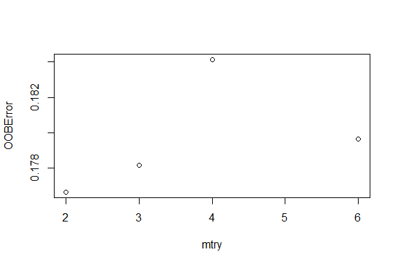

``` r
# Extract best value
bestmtryDF = data.frame(bestmtry)
bestM = bestmtryDF[which(bestmtryDF$OOBError == min(bestmtryDF$OOBError)),]$mtry

# Refit model with best mtry
modelTune <- randomForest(factor(Survived) ~ .,  
              data = underTrainDF, mtry = bestM)

# Predict
modelTunePred = predict(modelTune, newdata = trainTestSet)
predTestDF$predModel3Tune = modelTunePred
confTune = xtabs(~predModel3Tune + Survived, data = predTestDF)

# Add to table
tuneAcc = round((confTune[1,1] + confTune[2,2])/sum(confTune), 3)
tunePrec = round(confTune[1,1]/(confTune[1,1] + confTune[1,2]), 3)
tuneRecall = round(confTune[1,1]/(confTune[1,1] + confTune[2,1]), 3)

accDF$model = as.character(accDF$model)
accDF[5,] = c("tune", tuneAcc, tunePrec, tuneRecall)

accDF
```

    ##   model   acc recall  prec
    ## 1  orig 0.834  0.928 0.826
    ## 2  over 0.825  0.877 0.846
    ## 3 under 0.834  0.899 0.844
    ## 4  rose 0.834  0.957  0.81
    ## 5  tune 0.834  0.848 0.891

### Variable importance

What features seem to be most relevant to our classification?

``` r
# Get importance
importance    <- importance(modelTune)
varImportance <- data.frame(Variables = row.names(importance), 
                            Importance = round(importance[ ,'MeanDecreaseGini'],2))

importSort = varImportance[order(-varImportance$Importance),]
importSort
```

    ##                   Variables Importance
    ## Sex                     Sex      25.96
    ## title2.Mr         title2.Mr      24.02
    ## Fare                   Fare      15.11
    ## Age                     Age      11.78
    ## title2.Mrs       title2.Mrs       8.70
    ## title2.Miss     title2.Miss       8.53
    ## Pclass.3           Pclass.3       7.80
    ## familySize       familySize       6.77
    ## Pclass.1           Pclass.1       4.73
    ## SibSp                 SibSp       4.43
    ## Parch                 Parch       3.29
    ## Embarked.S       Embarked.S       2.23
    ## Pclass.2           Pclass.2       2.07
    ## Embarked.C       Embarked.C       1.99
    ## title2.Master title2.Master       1.86
    ## Embarked.Q       Embarked.Q       1.10
    ## title2.other   title2.other       0.97
    ## roomCount         roomCount       0.81

These are sensible results!
+ The "Mr." title combines information about age and sex - adult men were less likely to survive than women, girls, and boys. + Fare is strongly tied to class, so its high improtance tells ut that wealthier and poorer passengers had different fates (and may account for some variability within the classes too).
+ But age and sex are not far behind either.
+ We saw earlier that singletons and large families did not fare well; familySize bears that out.

Predict test data
-----------------

Now that we have a final model, we'll use it to predict survival on our true test set.

``` r
# Drop PassengerID from testSet
testSet$PassengerId = NULL

# Predict
modelTunePred = predict(modelTune, newdata = testSet)
finalPreds = data.frame(names(modelTunePred), modelTunePred)
colnames(finalPreds) = c("PassengerId", "Survived")

# Save to csv
write.csv(finalPreds, sprintf("%s/finalPreds_20oct2018.csv", wd), row.names = FALSE)
```
